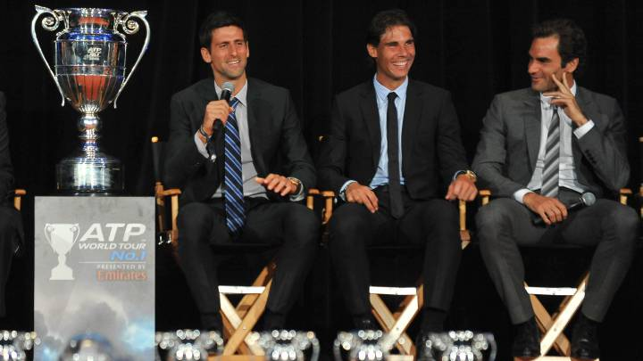

```{r packages-setup, include = FALSE}
library(tidyverse)
library(klippy)  #- remotes::install_github("rlesur/klippy")
library(knitr)
library(plotly)
library(hrbrthemes)
library(patchwork) 
library(gganimate)
library(gt)
library(lubridate)
library(plotly)
library(xts)
library(dygraphs)
library(robservable)
library(crosstalk)
library(reactable)
library(ggrepel)
```

```{r chunk-setup, include = FALSE}
knitr::opts_chunk$set(echo = TRUE, eval = TRUE, message = FALSE, warning = FALSE, 
                      #results = "hold",
                      cache = FALSE, cache.path = "/caches/", comment = "#>",
                      #fig.width = 7, #fig.height= 7,   
                      #out.width = 7, out.height = 7,
                      collapse = TRUE,  fig.show = "hold",
                      fig.asp = 0.828, out.width = "75%", fig.align = "center")
knitr::opts_chunk$set(dev = "png", dev.args = list(type = "cairo-png"))
```

```{r options-setup, include = FALSE}
options(scipen = 999) #- para quitar la notación científica
options("yaml.eval.expr" = TRUE) 
```

```{r klippy, echo = FALSE}
klippy::klippy(position = c("top", "right")) #- remotes::install_github("rlesur/klippy")
```

<hr class="linea-black">

<!-- El párrafo de abajo has de dejarlo casi igual, solo HAS de SUSTITUIR "perezp44" por tu usuario de Github-->

Trabajo elaborado para la asignatura "Programación y manejo de datos en la era del Big Data" de la Universitat de València durante el curso 2021-2022. El repo del trabajo está [aquí](https://github.com/joorge0603/trabajo_BigData){target="_blank"}.

<!-- El párrafo de abajo has de dejarlo exactamente igual, NO HAS DE CAMBIAR NADA-->

La página web de la asignatura y los trabajos de mis compañeros pueden verse [aquí](https://perezp44.github.io/intro-ds-21-22-web/07-trabajos.html){target="_blank"}.

<hr class="linea-black">

# 1. Introducción

El debate acerca de quién es el GOAT del tenis (el mejor jugador de todos los tiempos) se encuentra en su punto más álgido. Hasta mediados de 2008 no existía argumento que pudiese desbancar a Roger Federer de esta posición. Sin embargo, en la actualidad hay otros dos jugadores con méritos suficientes para disputar este título honorífico a *Su Majestad* Roger Federer. Ellos son Rafael Nadal y Novak Djokovic.

> "Si alguien dice que soy mejor que Roger, creo que no sabe nada sobre el tenis" Rafael Nadal

No resulta tarea sencilla establecer qué jugador es el mejor de todos los tiempos. Lo logrado por parte de Federer, Nadal y Djokovic durante estos últimos 20 años es un hito que difícilmente se volverá a repetir. La hegemonía de estos tres deportistas apenas ha podido ser quebrada por unos pocos, creando una de las rivalidades más apasionantes de la historia de este deporte.

<br>

<center>

{width="width" height="height"}

<center>

A lo largo del documento trataremos de analizar cuál de estos grandes tenistas merece ser el GOAT del tenis. Para la realización de esta tarea, estableceremos una serie de criterios lo más objetivos posibles. No obstante, ante la posibilidad de no poder clarificar quién ha hecho más méritos debido a la grandeza de estos deportistas, al menos trataremos de aportar una visión más objetiva de en qué aspectos cada jugador ha sobresalido respecto al resto.

# 2. Datos {.tabset}

Para poder lograr obtener alguna conclusión, necesitamos datos a través de los cuáles obtener información. A lo largo del documento, haremos uso principalmente de tres datasets, los cuáles se muestran a continuación.

## Dataset *Grand Slams*

Uno de los criterios más usados para afirmar si un jugador ha logrado mayores éxitos que otro, es el número de Grand Slams que ha obtenido. Toda la información acerca de los campeones y subcampeones de Grand Slam se muestra a continuación.

```{r}
grand_slams <- rio::import(here::here("datos", "grand_slam_tidy.xlsx"))

grand_slams <- SharedData$new(grand_slams)

bscols(widths = c(3,NA,NA),
       list(filter_slider("Año", "Año", grand_slams, ~Año, width = "100%"),
            filter_checkbox("Major", "Major", grand_slams, ~Major, columns =1),
            filter_select("Campeón", "Campeón", grand_slams, ~Campeón),
            filter_select("Subcampeón", "Subcampeón", grand_slams, ~Subcampeón)),
       reactable(grand_slams, minRows = 10, defaultPageSize =  10, 
                 paginationType = "jump",  showPageSizeOptions =  TRUE , 
                 pageSizeOptions =  c ( 10 , 50 , 100 ),defaultColDef = colDef(
                   align = "center",
                   minWidth = 70,
                   headerStyle = list(background = "lightgreen"),
                   filterable = FALSE), highlight = TRUE,
                 outlined = TRUE))
```

## Dataset *Temporadas*

Las temporadas de tenis constan de numerosos torneos a lo largo y ancho del planeta desde enero hasta mediados/finales de noviembre. Gracias al dataset siguiente, tenemos los datos más relevantes de todos los partidos desde el año 2000 hasta el 2021. No obstante, para una mejor visualización de los datos, hemos juntado las distintas temporadas en un solo dataset y se han elegido las variables más relevantes entre las más de 30 de las que disponemos.

```{r, include=FALSE}
temporadas <- rio::import(here::here("datos", "temporadas.csv"))
```

```{r, eval = TRUE}
temporadas <- SharedData$new(temporadas)

bscols(widths = c(3,NA,NA),
       list( filter_checkbox("Series", "Series", temporadas, ~Series, columns =1), 
             filter_slider("Date", "Date",
                           temporadas, ~Date, width = "100%"),
             filter_checkbox("Surface", "Surface", temporadas, ~Surface, columns =1),
             filter_select("Winner", "Winner", temporadas, ~Winner),
             filter_select("Loser", "Loser", temporadas, ~Loser)),
       reactable(temporadas, minRows = 10, defaultPageSize =  10, 
                 paginationType = "jump",  showPageSizeOptions =  TRUE , 
                 pageSizeOptions =  c ( 10 , 50 , 100 ),defaultColDef = colDef(
                   align = "center",
                   minWidth = 70,
                   headerStyle = list(background = "lightgreen"),
                   filterable = FALSE), highlight = TRUE,
                 outlined = TRUE))
```

## Dataset *Ranking*

El ranking ATP se forma a través de los puntos que otorgan los torneos a los jugadores según su resultado en el mismo. En el dataset siguiente se muestra el top 1000 del ranking ATP desde enero del 2000 hasta la actualidad. Cabe destacar que, por motivos de simplicidad, se ha reducido su dimensión y solo se mostrará el top 10 semanal.

```{r, include=FALSE}
ranking <- rio:::import(here::here("datos", "ranking.rds"))
```

```{r}
ranking <- SharedData$new(ranking)

bscols(widths = c(3,NA,NA),
       list(filter_select("ranking_date", "ranking_date",
                           ranking, ~ranking_date),
            filter_select("name", "name", ranking, ~name),
            filter_slider("rank", "rank", ranking, ~rank, width = "100%")),
       reactable(ranking, minRows = 10, defaultPageSize =  10, 
                 paginationType = "jump",  showPageSizeOptions =  TRUE , 
                 pageSizeOptions =  c ( 10 , 50 , 100 ),defaultColDef = colDef(
                   align = "center",
                   minWidth = 70,
                   headerStyle = list(background = "lightgreen"),
                   filterable = FALSE), highlight = TRUE,
                 outlined = TRUE))
```

```{r, include=FALSE}
grand_slams <- rio::import(here::here("datos",
                                      "grand_slam_tidy.xlsx"))
```

```{r, include=FALSE}
jugadores <- rio::import(here::here("datos", "jugadores.csv"))

ranking <- rio::import(here::here("datos", "ranking_tot.rds"))
```

# 3. Criterio 1: Mayor cantidad de títulos por categoría

Los fanáticos del tenis sabrán que los torneos profesionales se dividen en **cuatro categorías más la Copa de Maestros y los JJOO**. En este apartado trataremos de analizar qué jugador han ganado más torneos según la categoría.

## 3.1 Torneos de Grand Slam {.tabset}

### Grand Slams

Los Grand Slams son los torneos más importantes y prestigiosos del tenis. Esta categoría está formada por cuatro torneos (Australian Open, Roland Garros, Wimbledon y el US Open) y se celebran una vez cada uno a lo largo del año. Los jugadores que logran ganar alguno de estos torneos obtienen 2000 puntos para el ránking más el prestigio de ganar uno de los *grandes* del tenis.

En este último año, la prensa se ha hecho eco de la hazaña lograda por Djokovic, ganando tres de los cuatro Grand Slams del año y empatando de esta forma a 20 torneos *major* ganados con Federer y Nadal. En el gráfico que se muestra a continuación, se observa la evolución de Grand Slams ganados por parte de estos tres jugadores.

```{r}
grand_slams <- rio::import(here::here("datos",
                                      "grand_slam_tidy.xlsx"))

big3 <- grand_slams %>% 
  filter(Campeón %in% c("Rafael Nadal", "Novak Djokovic", 
                        "Roger Federer")) %>% 
  select(Año, Campeón) %>% group_by(Año, Campeón) %>%
  summarise(por_año = n()) %>% ungroup() %>% group_by(Campeón) %>%
  mutate(n_grand_slam = cumsum(por_año)) %>%
  mutate(n_grand_slam = as.numeric(n_grand_slam)) %>% ungroup()

big3 %>% ggplot(aes(x= Año, y= n_grand_slam)) + 
  labs(title = "Evolución Grand Slams ganados\npor el Big 3",
       x= "Año",
       y= "Número de Grand Slams",
       color = "Jugador") +
  geom_point(aes(color= Campeón), size= 3) +
  geom_line(aes(color= Campeón), size= 1.5) + 
  scale_color_manual(values = c("midnightblue", "darkgreen",
                                "sienna"), 
                     breaks = c("Roger Federer", "Rafael Nadal",
                                "Novak Djokovic")) +
  theme_minimal() +
  theme(plot.title = element_text(size = 20, face = "bold", 
                                  hjust = 0.5),
        axis.title.x = element_text(size = 13, hjust = 1, vjust = 0),
        axis.title.y = element_text(size = 13, hjust = 1, vjust = 1),
        legend.title = element_text(face = "bold")) +
  geom_text(aes(x = min(Año), y = min(n_grand_slam), 
                label = as.factor(Año)) , hjust= 0, vjust = -6.2,
            alpha = 1,  col = "gray", size = 20) +
  transition_reveal(Año) + 
  view_follow()
```

El primer jugador en alcanzar los 20 Grand Slams ganados fue Roger Federer, seguido de Rafael Nadal y, finalmente este año, Djokovic alcanzó esta cifra. Es difícil decir qué jugador terminará con un mayor número de Grand Slams. Por el momento la tendencia favorece a Djokovic, ya que en este año ha logrado ganar tres de estos torneos, mientras que ni Nadal ni Federer se han conseguido hacer con uno.

### Curiosidad

Siempre que llega un Grand Slam las casas de apuestas se llenan de predicciones sobre quién será la sorpresa del torneo. Ver ganar un Grand Slam a un jugador de fuera del Top 5 es algo bastante extraño en el tenis masculino. No tanto en el tenis femenino, donde este tipo de sorpresas son más habituales. El último caso fue el de la tenista británica Raducanu, quién en el pasado US Open ganó su primer grande siendo la número 150 del ranking WTA.

No obstante, volviendo al tenis masculino, ¿en qué torneo de Grand Slam se han dado más sorpresas?

```{r}
no_serie <- grand_slams %>% group_by(Major) %>% summarise(`No cabeza de serie` = sum(is.na(Cabeza_serie_campeón))) %>% arrange(desc(`No cabeza de serie`))

serie1 <- grand_slams %>% group_by(Major) %>% filter(Cabeza_serie_campeón == 1) %>% summarise(`Cabeza de serie 1` = n()) %>% arrange(desc(`Cabeza de serie 1`))

serie_menor_4 <- grand_slams %>% group_by(Major) %>% filter(Cabeza_serie_campeón <= 4) %>% summarise(`Cabeza de serie < 4` = n()) %>% arrange(desc(`Cabeza de serie < 4`))

serie_entre_4_y_10 <- grand_slams %>% group_by(Major) %>% filter(Cabeza_serie_campeón > 4 & Cabeza_serie_campeón <= 10) %>% summarise(`Cabeza de serie entre 4 y 10` = n()) %>% arrange(desc(`Cabeza de serie entre 4 y 10`))

serie_entre_10_y_32 <- grand_slams %>% group_by(Major) %>% filter(Cabeza_serie_campeón > 10 & Cabeza_serie_campeón <= 32) %>% summarise(`Cabeza de serie > 10` = n()) %>% arrange(desc(`Cabeza de serie > 10`))

a1 <- full_join(serie_menor_4, serie_entre_4_y_10, by= c("Major" = "Major"))  

a2 <- full_join(a1, serie_entre_10_y_32, by= c("Major" = "Major"))  

a3 <- full_join(a2, no_serie, by= c("Major" = "Major"))

a4 <- a3 %>% pivot_longer(cols = 2:5, names_to = "Cabeza de serie", values_to = "Ganadores", values_transform = list(Ganadores = as.numeric))

a5 <- a4 %>% mutate(`Cabeza de serie` = forcats::as_factor(`Cabeza de serie`))

ggplot(a5, aes(x=Major, y= Ganadores, fill= `Cabeza de serie`)) +
  geom_bar(stat = "identity", position = "dodge") +
  labs(title = "Número de ganadores por cabeza de serie") +
  scale_x_discrete(labels = c("Australian\nOpen", "Roland\nGarros", "US\nOpen", "Wimbledon")) +
  theme_ipsum() +
  theme(plot.title = element_text(face = "bold", hjust = 0.5),
        legend.title = element_text(face = "bold"),
        axis.title.x = element_text(size = 13, face = "bold"),
        axis.title.y = element_text(size = 13, face = "bold"))
```

La gráfica anterior nos muestra que el torneo dónde más sorpresas se han producido es Roland Garros. Históricamente es el torneo en el que menos veces ha ganado un jugador del Top 4 y en que más veces ha ganado un jugador que llegaba al torneo sin ser ser cabeza de serie (jugador dentro de los 32 jugadores con mejor ranking inscritos al torneo). Por otra parte, Wimbledon es el torneo en el que más veces ha ganado un cabeza de serie menor al 4 y el US Open el torneo en el que es menos probable que un jugador sin ser cabeza de serie gane.

Estos datos resultarán de gran interés para quién desee apostar esta temporada que empieza. Pero cuidado, desde que Rafael Nadal impuso su ley en Roland Garros, en 13 de las últimas 17 ediciones del torneo el ganador ha sido el tenista español. Sin duda, la mejor opción para la victoria.

## 3.2 Resto de torneos

Continuando con el análisis, prestaremos atención a los resultados obtenidos en el resto de torneos profesionales por parte de estos tenistas.

```{r}
a <- rio::import(here::here("datos", "temporadas.csv"))

m1000 <- a %>% filter(Series %in% c("Masters 1000", "Masters"), Round == "The Final", Winner %in% c("Nadal R.", "Federer R.", "Djokovic N.")) %>% group_by(Winner) %>% summarise(total_masters_1000 = n())

masters <- a %>% filter(Series %in% c("Masters Cup"), Round == "The Final", Winner %in% c("Nadal R.", "Federer R.", "Djokovic N.")) %>% group_by(Winner) %>% summarise(total_masters_cup = n())

atp500 <- a %>% filter(Series %in% c("ATP500", "International Gold"), Round == "The Final", Winner %in% c("Nadal R.", "Federer R.", "Djokovic N.")) %>% group_by(Winner) %>% summarise(total_atp_500 = n())

atp250 <- a %>% filter(Series %in% c("ATP250", "International"), Round == "The Final", Winner %in% c("Nadal R.", "Federer R.", "Djokovic N.")) %>% group_by(Winner) %>% summarise(total_atp_250 = n())

total<- full_join(masters, m1000, by= c("Winner" = "Winner"))
jjoo <- c(0,0,1)
total <- cbind(total, jjoo)
total <- full_join(total, atp500, by= c("Winner" = "Winner"))
total <- full_join(total, atp250, by= c("Winner" = "Winner"))
total <- total %>% 
  select(Winner, total_masters_cup, jjoo, total_masters_1000,
         total_atp_500, total_atp_250) %>% 
  mutate(total_masters_cup = 
           ifelse(is.na(total_masters_cup), 0, total_masters_cup)) %>%
  pivot_longer(cols = 2:6, names_to = "Categoría", values_to = "Número") 

total <- total %>% pivot_wider(names_from = "Winner", values_from = "Número") %>% mutate(Categoría = case_when(
  Categoría == "total_masters_cup" ~ "Copa de Maestros",
  Categoría == "jjoo" ~ "Juegos Olímpicos",
  Categoría == "total_masters_1000" ~ "Masters 1000",
  Categoría == "total_atp_500" ~ "ATP 500",
  Categoría == "total_atp_250" ~ "ATP 250",
  TRUE ~ Categoría))

total %>% gt(rowname_col = "Categoría") %>% 
  tab_header(title = "Número de torneos por categoría",
             subtitle = "Excluyendo torneos de Grand Slam") %>% 
  tab_options(heading.background.color = "#D4AF37") %>% tab_options(heading.title.font.size = 22, heading.subtitle.font.size = 15,  column_labels.font.weight =  "bold") %>% 
  cols_align(align = "center") %>% 
  cols_label(
    `Djokovic N.` = "Novak Djokovic",
    `Federer R.` = "Roger Federer",
    `Nadal R.` = "Rafael Nadal") %>% 
  cols_move_to_start(
    columns = c(`Federer R.`, `Nadal R.`, `Djokovic N.`)) %>% 
  tab_footnote(
    footnote = "Medalla de oro en individuales",
    locations = cells_stub(rows = 2)) %>% 
  tab_footnote(
    footnote = "Previo a 2009 llamados International Gold",
    locations = cells_stub(rows = 4)) %>% 
  tab_footnote(
    footnote = "Previo a 2009 llamados International",
    locations = cells_stub(rows = 5)) %>% 
  tab_style(style = list(cell_fill(color = "green")),
            locations = cells_body(columns = `Federer R.`,
      rows = c(1, 4, 5))) %>% 
  tab_style(style = list(cell_fill(color = "green")),
            locations = cells_body(columns = `Nadal R.`,
                                   rows = 2))  %>% 
  tab_style(style = list(cell_fill(color = "green")),
            locations = cells_body(columns = `Djokovic N.`,
                                   rows = 3)) 

```

Se torna complicado concluir qué jugador presenta mejores cifras. Entre los tres se reparten el liderato en las tres categorías de importancia restantes. Federer es el jugador que mayor número de Copas de Maestro tiene. Por otro lado, Nadal es el único de los tres en obtener una medalla de oro en individuales en unos Juegos Olímpicos. Y en cuanto a Masters 1000 se refiere, es Djokovic el que lidera esta clasificación con 37, uno más que los ganados por Nadal. Finalmente, es lógico que Federer sea el jugador que mayor cantidad de torneos ATP 500 y ATP 250 ha ganado, puesto que es 5 y 6 años mayor que Nadal y Djokovic, respectivamente.

De esta forma, no es posible concluir qué jugador del Big 3 tiene mejores números en cuanto a torneos ganados a día de hoy. Esto se debe a que las actuaciones de estos tres jugadores es sobresaliente en cada categoría. Deberemos seguir repasando distintos criterios para tratar de dar respueta a nuestra cuestión.

# 4. Criterio 2: Ranking ATP

La importancia entre ganar un torneo u otro se define, entre otros aspectos como el prestigio, por la cantidad de puntos que reparte. En este apartado analizaremos cómo ha sido en rendimiento de estos tres jugadores a lo largo del tiempo.

```{r, out.width= "100%"}
jugadores <- jugadores %>% mutate(name = paste(name_first, name_last, sep = " "), .after = player_id) %>% select(player_id, name, ioc)

### Evolución puntos ATP

dd <- left_join(ranking, jugadores, by = c("player" = "player_id")) %>% filter(name %in% c("Rafael Nadal", "Roger Federer", "Novak Djokovic")) %>% mutate(ranking_date = ymd(ranking_date)) %>% mutate(points = as.numeric(points), rank = as.numeric(rank)) %>% select(ranking_date, points, name) %>% pivot_wider(names_from = "name", values_from = "points")

Federer <- xts(dd$`Roger Federer`, order.by = dd$ranking_date)

Nadal <- xts(dd$`Rafael Nadal`, order.by = dd$ranking_date)

Djokovic <- xts(dd$`Novak Djokovic`, order.by = dd$ranking_date)

p <- cbind(Federer, Nadal, Djokovic) 

dygraph(p, ylab= "Puntos ATP",
        main = "Evolución puntos ATP del Big 3") %>% 
  dyOptions(colors = c("blue", "green", "brown")) %>% 
  dyRangeSelector() 
```

Con el fin de observar el rendimiento del Big 3, hemos calculado la cantidad de puntos de cada jugador durante cada semana del año desde la temporada del año 2000, motivo por el cuál Federer empieza el periodo con alrededor de 900 puntos. Es increíble observar la regularidad de estos tres jugadores a lo largo de los años, siempre muy por encima de los 2000 puntos. Para que nos hagamos una idea, alrededor de 2000 puntos son los que necesita conseguir un jugador en un año para estar dentro del Top 20...

Sin embargo, podemos apreciar que el rendimiento y regularidad es algo mayor en Djokovic que en el resto, a excepción del periodo que abarca desde mediados de 2017 hasta finales de 2018 en el que el tenista balcánico sufrió problemas de espalda.

```{r}
ranking2 <- ranking

Top_1 <- left_join(ranking2, jugadores, by = c("player" = "player_id")) %>% filter(name %in% c("Rafael Nadal", "Roger Federer", "Novak Djokovic")) %>% mutate(ranking_date = ymd(ranking_date)) %>% mutate(points = as.numeric(points), rank = as.numeric(rank)) %>% select(ranking_date, rank, name) %>% filter(rank == 1) %>% group_by(name) %>% summarise(Top1 = n()) 

Tot <- left_join(ranking2, jugadores, by = c("player" = "player_id")) %>% filter(name %in% c("Rafael Nadal", "Roger Federer", "Novak Djokovic")) %>% mutate(ranking_date = ymd(ranking_date)) %>% mutate(points = as.numeric(points), rank = as.numeric(rank)) %>% select(ranking_date, rank, name) %>% drop_na() %>%  group_by(name) %>% summarise(Tot = n())

Top_3 <- left_join(ranking2, jugadores, by = c("player" = "player_id")) %>% filter(name %in% c("Rafael Nadal", "Roger Federer", "Novak Djokovic")) %>% mutate(ranking_date = ymd(ranking_date)) %>% mutate(points = as.numeric(points), rank = as.numeric(rank)) %>% select(ranking_date, rank, name) %>% filter(rank <= 3) %>% group_by(name) %>% summarise(Top3 = n())

Top_10 <- left_join(ranking2, jugadores, by = c("player" = "player_id")) %>% filter(name %in% c("Rafael Nadal", "Roger Federer", "Novak Djokovic")) %>% mutate(ranking_date = ymd(ranking_date)) %>% mutate(points = as.numeric(points), rank = as.numeric(rank)) %>% select(ranking_date, rank, name) %>% filter(rank <= 10) %>% group_by(name) %>% summarise(Top10 = n())

tabla <- left_join(Top_1, Top_3, by = c("name" = "name"))

tabla <- left_join(tabla, Top_10, by = c("name" = "name"))

tabla <- left_join(tabla, Tot, by = c("name" = "name"))

tabla <- tabla %>% mutate(Top1_porc = Top1/Tot, .after = Top1) %>% mutate(Top3_porc = Top3/Tot, .after = Top3) %>% mutate(Top10_porc = Top10/Tot, .after = Top10) 
  
tabla %>% gt(rowname_col = "name") %>% 
  tab_header(title = "Numero de semanas top del ranking ATP",
                      subtitle = "Jugadores del Big3") %>% 
  tab_options(heading.background.color = "#CD7F32") %>% tab_options(heading.title.font.size = 22, heading.subtitle.font.size = 15,  column_labels.font.weight =  "bold") %>% 
  cols_align(align = "center") %>% 
  cols_label(
    Top1 = "Top 1",
    Top1_porc = "Porcentaje",
    Top3 = "Top 3",
    Top3_porc = "Porcentaje",
    Top10 = "Top 10",
    Top10_porc = "Porcentaje",
    Tot = "Total") %>% 
  fmt_percent(columns= c(3, 5, 7), 
              decimals = 2) %>% 
  tab_style(style = list(cell_fill(color = "green")),
            locations = cells_body(columns = Top1,
                                   rows = 1)) %>% 
  tab_style(style = list(cell_fill(color = "green")),
            locations = cells_body(columns = Top1_porc,
                                   rows = 1))  %>% 
  tab_style(style = list(cell_fill(color = "green")),
            locations = cells_body(columns = Top3,
                                   rows = 3))  %>% 
  tab_style(style = list(cell_fill(color = "green")),
            locations = cells_body(columns = Top3_porc,
                                   rows = 1))  %>% 
  tab_style(style = list(cell_fill(color = "green")),
            locations = cells_body(columns = Top10,
                                   rows = 3)) %>% 
  tab_style(style = list(cell_fill(color = "green")),
            locations = cells_body(columns = Top10_porc,
                                   rows = 2)) 
```

La tabla anterior nos termina de dar un visión acerca de los increíbles números de Novak Djokovic. El tenista serbio es el jugador de la historia que más semanas ha estado al frente del ranking mundial, seguido de Federer. Además, este récord se sigue ampliando semana tras semana, puesto que Djokovic es el actual número 1 del mundo. Además, es el jugador que más porcentaje de semanas ha estado en el Top 3. El único aspecto en el que no es el líder, es en el porcentaje de semanas dentro del Top 10. En este aspecto Nadal es el número 1, con más del 80% del tiempo que lleva como profesional dentro de los 10 mejores del mundo. Una muestra más de la precocidad y la regularidad del tenista español.

En este apartado, podemos concluir que Novak Djokovic es el mejor de todos los tiempos. Su récord al frente del ranking es, sin duda alguna, uno de los más dominantes del deporte mundial. Un récord difícilmente de superar y del que solo podemos sentir orgullo por haber podido vivirlo.

# 5. Criterio 3: Superficie de juego

El tenis es sin lugar a dudas uno de los deportes en los que existe una mayor diversidad de estilos y formas de juego. Esto, sumado a la existencia de las diferentes superficies de juego en las que se disputan los torneos, crean la combinación perfecta para que dependiendo de en la parte de la temporada en la que nos encontremos, las condiciones climáticas y la superficie de juego unos jugadores destaquen más sobre el resto que otros.

Históricamente existían 4 superficies de juego:

-   Tierra batida: pistas creadas en base a polvo de ladrillo que destacan por ser las más lentas y por un bote de bola alto.

-   Superficie dura: pistas de cemento cuya rapidez varía según el tipo de material con que se fabriquen.

-   Hierba: destacan por su rapidez y por su bajo bote de bola.

-   Moqueta: destacan por su alta velocidad de bola y por jugarse bajo techo.

Sin embargo, desde la temporada 2009, la ATP decidió eliminar los torneos que se disputaban sobre moqueta, remplazándolos por superficie dura. De esta forma, los distintos torneos disputados a lo largo del año se disputan o bien el tierra, dura o hierba y o bien al aire libre o bajo techo. Dependiendo la combinación de estos dos aspectos, las condiciones de juego cambian drásticamente.

De esta forma, se podría decir que existen *distintos tipos de tenis*. Por ello, a continuación trataremos de analizar el rendimiento del Big 3 de acuerdo al tipo de pista.

```{r}
temporadas <- rio::import(here::here("datos", "temporadas.csv"))

aa <- temporadas %>% filter(Winner %in% c("Federer R.", "Nadal R.", "Djokovic N."), Round == "The Final") %>% group_by(Surface, Court, Winner) %>% summarise(títulos = n()) %>% ungroup() %>% 
  mutate(Surface = case_when(
    Surface =="Carpet" ~  "Moqueta",
    Surface =="Clay" ~  "Tierra batida",
    Surface =="Grass" ~  "Hierba",
    Surface =="Hard" ~  "Dura")) %>% 
  mutate(Court = case_when(
    Court =="Indoor" ~  "Bajo techo",
    Court =="Outdoor" ~  "Aire libre")) %>% 
  mutate(Winner = case_when(
    Winner =="Federer R." ~  "Federer",
    Winner =="Nadal R." ~  "Nadal",
    Winner =="Djokovic N." ~  "Djokovic"))

ggplot(aa, aes(x = Winner, y = títulos, fill = Court)) +
  geom_bar(stat = "identity") +
  labs(title = "Número de títulos por superficie", 
       subtitle = "Superficie: {closest_state}",
       fill= "Tipo de pista") +
  geom_text(aes(label = títulos),
            position =  position_stack(vjust = 0.8),
            fontface= "bold",
            size = 5) +
  scale_fill_manual(values = c("grey", "yellow")) +
  theme_classic() +
  theme(axis.ticks.y=element_blank(), 
        axis.text.y=element_blank(),
        axis.text.x = element_text(size = 15),
        axis.title.x = element_blank(),
        axis.title.y = element_blank(),
        plot.title = element_text(size = 20, hjust = 0.5, face = "bold"),
        plot.subtitle = element_text(size = 15, hjust = 0.5),
        legend.title = element_text(face = "bold", size = 15),
        legend.text = element_text(size = 12)) +
  transition_states(states = Surface, transition_length = 2, state_length = 1) + 
  enter_fade() + 
  exit_shrink() +
  ease_aes('sine-in-out')
```

Del gráfico anterior extraemos distintas conclusiones.

La primera, **Rafael Nadal es el mejor jugador de la historia en tierra batida**. Esta afirmación no es discutida por nadie hoy en día. Sus resultados sobre esta superficie son superlativos. Además, los ha conseguido en una de las eras más competitivas de la historia. Simplemente, no hay palabras para describir lo logrado por este jugador. Muy probablemente nadie más sea capaz de igualarle.

La segunda es acerca de la regularidad y versatilidad de **Novak Djokovic**. Sin duda, **el jugador más versátil de la historia**. Capaz de jugar rozando la perfección en el tipo de pista en la que juegue.

Y a tercera, **Federer es el mejor en pistas de alta velocidad**. Cuanto más rápida es una pista de tenis, la perfección suiza es capaz de mostrar al mundo el porqué de que la definición de tenis perfecto sea Federer.

# 6. Criterio 4: Mayor número de victorias ante jugadores Top

Seguimos tratando de dar una respuesta a *¿Quién es el GOAT del tenis?*. Y para tratar de obtener una respuesta, es necesario realizar una parada para analizar cuál ha sido el rendimiento del Big 3 frente a otros grandes jugadores del circuito.

El gráfico que se muestra a continuación nos muestra las victorias y derrotas del Big 3 frente a jugadores cuyo ránking era:

-   Número 1 del mundo.

-   Entre el 2 y el 5 del mundo.

-   Entre el 6 y el 10 del mundo.

-   Entre el 11 y el 20 del mundo.

```{r}
tt <- temporadas %>% filter(Winner %in% c("Federer R.", "Nadal R.", "Djokovic N.") | Loser %in% c("Federer R.", "Nadal R.", "Djokovic N.")) %>% mutate(WRank = as.numeric(WRank), LRank = as.numeric(LRank))

#Top 20
v_top20 <- tt %>% filter(Winner %in% c("Federer R.", "Nadal R.", "Djokovic N.") & LRank <= 20 & LRank > 10) %>% group_by(Winner) %>% summarise(Victorias = n())

d_top20 <- tt %>% filter(Loser %in% c("Federer R.", "Nadal R.", "Djokovic N.") & WRank <= 20 & WRank > 10) %>% group_by(Loser) %>% summarise(Derrotas = n())

Top20 <- full_join(v_top20, d_top20, by = c("Winner" = "Loser")) %>% pivot_longer(cols = 2:3, names_to = "V/D", values_to = "Número")

d <- c("Top 20", "Top 20", "Top 20", "Top 20", "Top 20", "Top 20")

Top20 <- cbind(Top20, d)


#Top 10
v_top10 <- tt %>% filter(Winner %in% c("Federer R.", "Nadal R.", "Djokovic N.") & LRank <= 10 & LRank > 5) %>% group_by(Winner) %>% summarise(Victorias = n())

d_top10 <- tt %>% filter(Loser %in% c("Federer R.", "Nadal R.", "Djokovic N.") & WRank <= 10 & WRank > 5) %>% group_by(Loser) %>% summarise(Derrotas = n())

Top10 <- full_join(v_top10, d_top10, by = c("Winner" = "Loser")) %>% pivot_longer(cols = 2:3, names_to = "V/D", values_to = "Número")

d <- c("Top 10", "Top 10", "Top 10", "Top 10", "Top 10", "Top 10")

Top10 <- cbind(Top10, d)

#Top 5
v_top5 <- tt %>% filter(Winner %in% c("Federer R.", "Nadal R.", "Djokovic N.") & LRank <= 5 & LRank > 1) %>% group_by(Winner) %>% summarise(Victorias = n())

d_top5 <- tt %>% filter(Loser %in% c("Federer R.", "Nadal R.", "Djokovic N.") & WRank <= 5 & WRank > 1) %>% group_by(Loser) %>% summarise(Derrotas = n())

Top5 <- full_join(v_top5, d_top5, by = c("Winner" = "Loser")) %>% pivot_longer(cols = 2:3, names_to = "V/D", values_to = "Número")

d <- c("Top 5", "Top 5", "Top 5", "Top 5", "Top 5", "Top 5")

Top5 <- cbind(Top5, d)

#Top 1
v_top1 <- tt %>% filter(Winner %in% c("Federer R.", "Nadal R.", "Djokovic N.") & LRank == 1) %>% group_by(Winner) %>% summarise(Victorias = n())

d_top1 <- tt %>% filter(Loser %in% c("Federer R.", "Nadal R.", "Djokovic N.") & WRank == 1) %>% group_by(Loser) %>% summarise(Derrotas = n())

Top1 <- full_join(v_top1, d_top1, by = c("Winner" = "Loser")) %>% pivot_longer(cols = 2:3, names_to = "V/D", values_to = "Número")

d <- c("Top 1", "Top 1", "Top 1", "Top 1", "Top 1", "Top 1")

Top1 <- cbind(Top1, d)

### Gráfico
Top <- rbind(Top1, Top5, Top10, Top20) %>% 
  mutate(Winner = case_when(
  Winner =="Federer R." ~  "Federer",
  Winner =="Nadal R." ~  "Nadal",
  Winner =="Djokovic N." ~  "Djokovic")) %>% 
  mutate(`V/D` = forcats::as_factor(`V/D`)) %>% 
  mutate(`V/D` = forcats::fct_reorder(`V/D`, Número, .desc = TRUE)) %>% 
  mutate(d = forcats::as_factor(d)) %>% 
  mutate(d = forcats::fct_reorder(d, Número, .desc = FALSE))

Top %>% ggplot() +
  geom_bar(aes(x= Winner, y= Número, fill= `V/D`), stat = "identity",
           position = "dodge") +
  scale_fill_viridis_d() +
  facet_wrap(vars(d)) +
  theme_test() +
  labs(title = "Estadísticas Victorias/Derrotas Big 3",
       subtitle = "Clasificación por ranking") +
  theme(plot.title = element_text(size = 20, hjust = 0.5),
        plot.subtitle = element_text(size = 15, hjust = 0.5),
        legend.title = element_blank(),
        axis.title.x = element_blank(),
        axis.title.y = element_blank(),
        axis.text.x = element_text(size = 11),
        strip.text = element_text(face = "bold"))
```

Realizaremos este análisis dedicando a cada jugador su propio párrafo en relación al resto.

Empezaremos por **Novak Djokovic**. Aun siendo el más joven de los tres, es el que presenta mejores cifras entre victorias y derrotas frente a jugadores entre el 2 y 10 del mundo. Además, tiene un muy buen ratio cuando a enfrentado al número 1 del mundo.

Seguidamente tenemos a **Roger Federer**. Al ser el más veterano, es el jugador con más victorias frente a jugadores desde el 2 al 20 del ranking. No obstante, también el que más derrotas ha acumulado. Por otro lado, su rendimiento frente a números 1 del mundo es el más pobre de los tres. Un mayor y mejor análisis sería necesario para determinar los motivos detrás de este pobre rendimiento frente a números 1. Sin embargo, lo cierto es que es ampliamente superado por Djokovic y especialmente por Nadal en este aspecto.

Finalmente, **Nadal**. Su rendimiento frente a jugadores entre el 2 y 20 del ránking es el peor de los tres. Sin embargo, Nadal se lleva el título de *mata gigantes*. Es el único de los tres que tiene más victorias que derrotas ante números 1. Un logro al alcance únicamente del jugador español. Su pundonor y su tenis le llevan a ser el tenista más temido por los mejores.

# 7. Criterio 5: Temporada de inicio en la élite

El quinto de los criterios del que haremos uso es el rendimiento de estos tres jugadores en su temporada de inicio en la élite. Para poder utilizar este criterio, primero debemos determinar qué temporada consideramos que fue la primera en la que cada jugador comenzó a competir en la élite de este deporte. Esta no es una elección sencilla. No obstante, consideraremos la temporada en la que ganaron su primer Grand Slam como la temporada en la que cada miembro del Big 3 comenzó a ser considerado como un *jugador de élite*.

```{r, include=FALSE}
temporada_08 <- rio::import(here::here("datos", "atp_2008.xls"))
temporada_05 <- rio::import(here::here("datos", "atp_2005.xls"))
temporada_03 <- rio::import(here::here("datos", "atp_2003.xls"))
```

## Estadísticas generales

En anteriores apartados pudimos desgranar los títulos ganados por cada jugador. De este análisis obtenemos tres años de especial relevancia: 2003, 2005 y 2008, los años en los que Roger Federer, Rafael Nadal y Novak Djokovic ganaron su primer Grand Slam, respectivamente. De esta forma, analizaremos como fue el rendimiento de cada jugador en su correspondiente año, el cuál pasaremos a considerar su **temporada de inicio en la élite**.

```{r, include=FALSE}
Edad <- c(22, 19, 21)
Títulos <- c(7, 11, 4)
Temporada <- c(2003, 2005, 2008)
```

```{r}
gan_fed <- temporada_03 %>% filter(Winner == "Federer R.") %>% group_by(Winner) %>% summarise(Ganados =n())

per_fed <- temporada_03 %>% filter(Loser == "Federer R.") %>% group_by(Loser) %>% summarise(Perdidos =n())

part_fed <- left_join(gan_fed, per_fed, by = c("Winner" = "Loser"))

## Nadal
gan_nad <- temporada_05 %>% filter(Winner == "Nadal R.") %>% group_by(Winner) %>% summarise(Ganados =n())

per_nad <- temporada_05 %>% filter(Loser == "Nadal R.") %>% group_by(Loser) %>% summarise(Perdidos =n())

part_nad <- left_join(gan_nad, per_nad, by = c("Winner" = "Loser"))

## Djokovic
gan_djo <- temporada_08 %>% filter(Winner == "Djokovic N.") %>% group_by(Winner) %>% summarise(Ganados =n())

per_djo <- temporada_08 %>% filter(Loser == "Djokovic N.") %>% group_by(Loser) %>% summarise(Perdidos =n())

part_djo <- left_join(gan_djo, per_djo, by = c("Winner" = "Loser"))

Foto <- c("https://www.atptour.com/-/media/tennis/players/head-shot/2020/federer_head_ao20.png", "https://www.atptour.com/-/media/tennis/players/head-shot/2020/nadal_head_ao20.png", "https://www.atptour.com/es/players/novak-djokovic/d643/www.atptour.com/-/media/tennis/players/head-shot/2019/djokovic_head_ao19.png")

Nacionalidad <- c("https://www.ecured.cu/images/2/20/Bandera_suiza.JPG", "https://upload.wikimedia.org/wikipedia/commons/thumb/8/89/Bandera_de_Espa%C3%B1a.svg/1200px-Bandera_de_Espa%C3%B1a.svg.png", "https://upload.wikimedia.org/wikipedia/commons/thumb/f/ff/Flag_of_Serbia.svg/1200px-Flag_of_Serbia.svg.png")

part <- rbind(part_fed, part_nad, part_djo) %>% mutate(Porcentaje = Ganados/(Ganados + Perdidos))

tabla <- cbind(Foto, part, Nacionalidad, Edad, Temporada, Títulos) %>%  
  mutate(Winner = case_when(
    Winner =="Federer R." ~  "Roger Federer",
    Winner =="Nadal R." ~  "Rafael Nadal",
    Winner =="Djokovic N." ~  "Novak Djokovic"))

tabla %>% gt(rowname_col = "Foto", groupname_col = "Winner") %>% 
  text_transform(locations = cells_stub(rows = 1:3), fn = function(x) {gt::web_image(x, height = 50)}) %>%
  text_transform(locations = cells_body(columns = vars(Nacionalidad)), fn = function(x) {gt::web_image(x, height = 50)}) %>% 
  cols_align(align = "center") %>% 
  cols_move_to_start(columns = "Edad") %>% 
  cols_move(columns = "Temporada",
            after = "Edad") %>% 
  cols_move(columns = "Títulos",
            after = "Temporada") %>% 
  tab_header(title = "Estadíticas Big 3",
             subtitle = "Temporada inicio en la élite") %>%
  tab_spanner(label = "Partidos",
              columns = c("Ganados", "Perdidos", "Porcentaje")) %>% 
  tab_options(heading.background.color = "#DAA520") %>% tab_options(heading.title.font.size = 30, heading.subtitle.font.size = 25,  column_labels.font.weight =  "bold") %>% 
  fmt_percent(columns = "Porcentaje", 
              decimals = 2)
```

Al estar comparando diferentes años para cada jugador, la edad que cada jugador tenía en ese año varía. El jugador más joven en diputar su primera temporada en la élite fue Rafael Nadal. Con 19 años, el jugador español ganó en la temporada 2005 su primer Grand Slam. Además de ser el más joven, también fue el que mayor porcentaje de victorias tuvo en su temporada, ganando 77 de 87 partidos y obteniendo de esta forma 11 títulos ATP. Por su parte, Federer fue el más tardío en explotar, llegando a sus 22 años el primero de su Grand Slams en 2003. Finalmente, Djokovic es el menos laureado en su temporada de debut en la élite, sumando 3 títulos más a su primer Grand Slam.

No es descarado decir que la temporada de debut de Nadal fue la que más sobresalió. Ya no solo por el asombroso número de títulos, sino también por su corta edad. A continuación, podemos observar la distribución geográfica de los títulos de cada jugador.

```{r}
## Federer
titulos_fed <- temporada_03 %>% filter(Winner == "Federer R.") %>% filter(Round == "The Final") %>% select(Location, Winner)

## Nadal
titulos_nad <- temporada_05 %>% filter(Winner == "Nadal R.") %>% filter(Round == "The Final") %>% select(Location, Winner)


## Djokovic
titulos_djo <- temporada_08 %>% filter(Winner == "Djokovic N.") %>% filter(Round == "The Final") %>% select(Location, Winner)


titulos <-rbind(titulos_fed, titulos_nad, titulos_djo)

iso2 <- c("FR", "AE", "DE", "DE", "GB", "AT", "US", "BR", "MX", "MC", "ES", "IT", "FR", "SE", "DE", "CA", "CN", "ES", "AU", "US", "IT", "CN" )

total <- cbind(iso2, titulos) %>%  
  mutate(Winner = case_when(
    Winner =="Federer R." ~  "Federer",
    Winner =="Nadal R." ~  "Nadal",
    Winner =="Djokovic N." ~  "Djokovic"))

long <- c(5.37639, 55.3077, 11.5753, 11.97, -0.1275, 16.3728, -95.3863, -37.9224, -99.8816, 7.41284, 2.16992, 12.4942, 2.3486000, 12.8529, 9.18278, -73.58781, 116.39723, -3.70325, 144.96332, -116.341, 12.4942, 121.469)

lat <- c(43.2967, 25.2646, 48.1369, 51.4828, 51.5072, 48.2092, 29.7805, -12.4319, 16.8638, 43.7503, 41.3879, 41.8905, 48.8534000, 56.4267, 48.7756, 45.50884, 39.9075, 40.4167, -37.814, 33.7052, 41.8905, 31.2323)

num <- c(1, 2, 1, 1, 1, 1, 3, 3, 3, 1, 1, 1, 1, 1, 1, 3, 2, 1, 2, 3, 1, 2)

torneos <- cbind(total, long, lat, num)

torneos1 <- torneos %>% filter(num == 1)

torneos2 <- torneos %>% filter(num == 2)

torneos3 <- torneos %>% filter(num == 3)

mapa_mundo <- map_data("world") %>% mutate(iso2 = countrycode::countrycode(sourcevar = region, origin = "country.name",destination =  "iso2c", warn = FALSE), .after = region) %>% select(long, lat, group, iso2)

mapa_mundo %>%
  ggplot() +
  geom_polygon(aes(x= long, y = lat, group = group), fill = "grey",
               color = "black", na.rm = FALSE) +
  theme_void() +
  theme(plot.title = element_text(hjust = 0.5, size = 18, face = "bold", vjust = 2),
        plot.subtitle = element_text(hjust = 0.5, size= 12, vjust = 2),
    axis.line = element_blank(),
    axis.text = element_blank(),
    axis.title = element_blank(),
    axis.ticks = element_blank(),
    panel.background = element_rect(colour= "black", size= 1, fill = "#9fd5d1"),
    legend.text = element_text(face = "bold"),
    legend.title = element_text(face = "bold")) +
  geom_point(data = torneos, mapping = aes(x= long, y= lat, color= Winner), size= 2.2) +
  coord_fixed (xlim= c(-200,200),
               ylim= c(-58,90),
               ratio = 2.2) +
  scale_color_manual(values = c("midnightblue", "seagreen", "yellow")) + 
  labs(title = "Distribución geográfica títulos Big 3",
       subtitle = "Representación temporada inicio élite",
       color = "Jugador")
```

En el mapa anterior no se aprecia fácilmente las conquistas de cada jugador. Por ello, dividiremos el mapa en tres zonas para poder observarlo con mayor precisión.

```{r}
mapa_mundo %>%
  ggplot() +
  geom_polygon(aes(x= long, y = lat, group = group), fill = "grey",
               color = "black", na.rm = FALSE) +
  theme_void() +
  theme(plot.title = element_text(hjust = 0.5, size = 18, face = "bold", vjust = 2),
        plot.subtitle = element_text(hjust = 0.5, size= 12, vjust = 2),
        axis.line = element_blank(),
        axis.text = element_blank(),
        axis.title = element_blank(),
        axis.ticks = element_blank(),
        panel.background = element_rect(colour= "black", size= 1, fill = "#9fd5d1"),
        legend.text = element_text(face = "bold"),
        legend.title = element_text(face = "bold")) +
  geom_point(data = torneos3, mapping = aes(x= long, y= lat), color= "red", size= 2) +
  coord_fixed (xlim= c(-140,-35),
               ylim= c(-60,80))+
  geom_text_repel(data = torneos3, aes(x= long, y= lat, label = Location, color = Winner), fontface = "bold")  +
  scale_color_manual(values = c("midnightblue", "seagreen", "yellow")) + 
  labs(title = "Títulos continente americano del Big 3",
       subtitle = "Representación temporada inicio élite",
       color = "Jugador")
```

En cuanto a los títulos en suelo americano. Tanto Federer como Djokovic tan solo se pudieron hacer con uno de los torneos jugados en esta zona del planeta, mientras Nadal se hizo con 3 títulos, destacándose el Másters Series de Montreal.

```{r}
mapa_mundo %>%
  ggplot() +
  geom_polygon(aes(x= long, y = lat, group = group), fill = "grey",
               color = "black", na.rm = FALSE) +
  theme_void() +
  theme(plot.title = element_text(hjust = 0.5, size = 18, face = "bold", vjust = 2),
        plot.subtitle = element_text(hjust = 0.5, size= 12, vjust = 2),
        axis.line = element_blank(),
        axis.text = element_blank(),
        axis.title = element_blank(),
        axis.ticks = element_blank(),
        panel.background = element_rect(colour= "black", size= 1, fill = "#9fd5d1"),
        legend.text = element_text(face = "bold"),
        legend.title = element_text(face = "bold")) +
  geom_point(data = torneos1, mapping = aes(x= long, y= lat), color="red", size= 2) +
  coord_fixed (x= c(-10,20),
               y= c(35, 70))+
  geom_text_repel(data = torneos1, aes(x= long, y= lat, label = Location, color = Winner), fontface = "bold") +
  scale_color_manual(values = c("midnightblue", "seagreen", "yellow")) + 
  labs(title = "Títulos continente europeo del Big 3",
       subtitle = "Representación temporada inicio élite",
       color = "Jugador")
```

En el continente europeo fue donde Federer logró 5 de sus 7 títulos del año. Nadal por su parte ganaría 7, siendo 2 de ellos en España. En la otra cara de la moneda, Djokovic a penas lograría uno en el Másters Series de Roma.

```{r}
mapa_mundo %>%
  ggplot() +
  geom_polygon(aes(x= long, y = lat, group = group), fill = "grey",
               color = "black", na.rm = FALSE) +
  theme_void() +
  theme(plot.title = element_text(hjust = 0.5, size = 18, face = "bold", vjust = 2),
        plot.subtitle = element_text(hjust = 0.5, size= 12, vjust = 2),
        axis.line = element_blank(),
        axis.text = element_blank(),
        axis.title = element_blank(),
        axis.ticks = element_blank(),
        panel.background = element_rect(colour= "black", size= 1, fill = "#9fd5d1"),
        legend.text = element_text(face = "bold"),
        legend.title = element_text(face = "bold")) +
  geom_point(data = torneos2, mapping = aes(x= long, y= lat), color="red", size= 2) +
  coord_fixed (x= c(50,150),
               y= c(-40, 50))+
  geom_text_repel(data = torneos2, aes(x= long, y= lat, label = Location, color = Winner), fontface = "bold") +
  scale_color_manual(values = c("midnightblue", "seagreen", "yellow")) + 
  labs(title = "Títulos en Asia y Oceanía del Big 3",
       subtitle = "Representación temporada inicio élite",
       color = "Jugador")
```

Finalmente nos centramos en Asia y Oceanía. En esta parte del globo, el tenista serbio obtuvo la mitad de sus títulos ese año. Nadal y Federer tan solo conquistarían uno cada uno, siendo la parte del mundo en la que menos títulos logró Nadal.

## Evolución del ránking

Continuando con el análisis, otro aspecto a considerar es la evolución en el ránking de cada jugador a lo largo de su temporada de inicio.

```{r}
# Evolución del ranking

## Federer
temporada_03 <- rio::import(here::here("datos", "atp_2003.xls")) %>% mutate(WRank = as.numeric(WRank), LRank = as.numeric(LRank))

rank_ini <- temporada_03 %>% filter(Winner == "Federer R." | Loser == "Federer R.") %>% slice(1) %>% select(Winner, WRank) %>% rename(`2003-01-01` = WRank)

rank_fin <- temporada_03 %>% filter(Winner == "Federer R." | Loser == "Federer R.") %>% slice(n()) %>% select(Winner, WRank) %>% rename(`2003-12-31` = WRank)

rank_fed <- full_join(rank_ini, rank_fin, by = c("Winner" = "Winner"))

## Nadal
temporada_05 <- rio::import(here::here("datos", "atp_2005.xls")) %>% mutate(WRank = as.numeric(WRank), LRank = as.numeric(LRank))

rank_ini <- temporada_05 %>% filter(Winner == "Nadal R." | Loser == "Nadal R.") %>% slice(1) %>% select(Winner, WRank) %>% rename(`2003-01-01` = WRank)

rank_fin <- temporada_05 %>% filter(Winner == "Nadal R." | Loser == "Nadal R.") %>% slice(n()) %>% select(Winner, WRank) %>% rename(`2003-12-31` = WRank)

rank_nad <- full_join(rank_ini, rank_fin, by = c("Winner" = "Winner"))

## Djokovic
temporada_08 <- rio::import(here::here("datos", "atp_2008.xls")) %>% mutate(WRank = as.numeric(WRank), LRank = as.numeric(LRank))

rank_ini <- temporada_08 %>% filter(Winner == "Djokovic N." | Loser == "Djokovic N.") %>% slice(1) %>% select(Winner, WRank) %>% rename(`2003-01-01` = WRank)

rank_fin <- temporada_08 %>% filter(Winner == "Djokovic N." | Loser == "Djokovic N.") %>% slice(n()) %>% select(Winner, WRank) %>% rename(`2003-12-31` = WRank)

rank_djo <- full_join(rank_ini, rank_fin, by = c("Winner" = "Winner"))


rank <- rbind(rank_fed, rank_nad, rank_djo) %>% 
  mutate(Winner = case_when(
    Winner =="Federer R." ~  "Federer",
    Winner =="Nadal R." ~  "Nadal",
    Winner =="Djokovic N." ~  "Djokovic")) %>% 
  pivot_longer(cols = 2:3, names_to = "Periodo", values_to =  "Ranking") %>% 
  mutate(Periodo = month(Periodo)) %>% 
  mutate(Ranking = as.integer(Ranking)) %>% 
  rename(Jugador = Winner)

ggplot(rank, aes(Periodo, Ranking, group = Jugador, color=Jugador)) +
  geom_line(size  = 1.2) + 
  geom_point(size= 2.5) + 
  scale_y_reverse(breaks = seq(1, 55, 10)) +
  scale_x_continuous(breaks = seq(1, 12, 11), labels = c("Inicio", "Final")) +
  scale_color_viridis_d() +
  labs(title = "Evolución del ránking en la temporada\nde inicio élite"
  ) +
  theme(plot.title = element_text(hjust = 0.5)) + 
  theme_classic() +
  theme(plot.title = element_text(size = 20, hjust = 0.5),
        legend.title = element_blank(),
        legend.text = element_text(size = 15),
        axis.text = element_text(size = 15),
        axis.title = element_blank()) +
  transition_reveal(Periodo) 

```

La gráfica anterior es muy ilustrativa del gran salto en el ránking de Rafael Nadal en su temporada 2005. Avanzó 49 puestos, acabando el año como el segundo mejor jugador del planeta. En el caso de Federer y Djokovic, al tratarse de jugadores algo más mayores, ya se encontraban consolidados entre los 10 mejores. Ambos acabaron en el número 3 del ránking.

## Tops ganados

Por último, es de gran interés conocer el desempeño de estos jugadores frente a los grandes tenistas de su temporada de inicio. En este apartado, Federer es el que mejor ratio victorias/derrotas tiene. Djokovic fue el jugador que más partidos de alto nivel disputó, con un total de 10 victorias en 19 enfrentamientos. Nadal tuvo un notorio desempeño con 5 victorias y 3 derrotas. Sin embargo, al ser el jugador que más atrás en el ránking empezó el año, disputó menos partidos ante jugadores Top.

```{r}
#Federer
v_top10_fed <- temporada_03 %>% filter(Winner %in% c("Federer R.") & LRank <= 10) %>% group_by(Winner) %>% summarise(Victorias = n())

d_top10_fed <- temporada_03 %>% filter(Loser %in% c("Federer R.") & WRank <= 10) %>% group_by(Loser) %>% summarise(Derrotas = n())

Top10_fed <- full_join(v_top10_fed, d_top10_fed, by = c("Winner" = "Loser")) %>% pivot_longer(cols = 2:3, names_to = "V/D", values_to = "Número")

#Nadal
v_top10_nad <- temporada_05 %>% filter(Winner %in% c("Nadal R.") & LRank <= 10) %>% group_by(Winner) %>% summarise(Victorias = n())

d_top10_nad <- temporada_05 %>% filter(Loser %in% c("Nadal R.") & WRank <= 10) %>% group_by(Loser) %>% summarise(Derrotas = n())

Top10_nad <- full_join(v_top10_nad, d_top10_nad, by = c("Winner" = "Loser")) %>% pivot_longer(cols = 2:3, names_to = "V/D", values_to = "Número")

#Djokovic
v_top10_djo <- temporada_08 %>% filter(Winner %in% c("Djokovic N.") & LRank <= 10) %>% group_by(Winner) %>% summarise(Victorias = n())

d_top10_djo <- temporada_08 %>% filter(Loser %in% c("Djokovic N.") & WRank <= 10) %>% group_by(Loser) %>% summarise(Derrotas = n())

Top10_djo <- full_join(v_top10_djo, d_top10_djo, by = c("Winner" = "Loser")) %>% pivot_longer(cols = 2:3, names_to = "V/D", values_to = "Número") 


Top10 <- rbind(Top10_fed, Top10_nad, Top10_djo) %>% mutate(`V/D` = forcats::as_factor(`V/D`)) %>% mutate(`V/D` = forcats::fct_reorder(`V/D`, Número, .desc = TRUE)) %>% mutate(Winner = case_when(
  Winner =="Federer R." ~  "Federer",
  Winner =="Nadal R." ~  "Nadal",
  Winner =="Djokovic N." ~  "Djokovic"))

Top10 %>% ggplot(aes(x= Winner, y= Número, fill= `V/D`)) +
  geom_bar(stat = "identity",
           position = "dodge") +
  scale_y_continuous(breaks = seq(0, 10, 2)) +
  scale_fill_viridis_d() +
  geom_text(aes(y=Número, label = Número), 
            position = position_dodge(width = 0.9), size = 5, 
            vjust=1.5, col = "White", fontface = "bold") +
  labs(title = "Partidos frente a Top 10 temporada\ninicio en la élite",
       fill= "Resultado") +
  theme_ipsum() +
  theme(axis.title.x = element_blank(),
        axis.title.y = element_blank(),
        plot.title = element_text(hjust = 0.5),
        legend.title = element_text(face = "bold"))

```

De este modo, en este apartado podemos afirmar que Nadal es el jugador que explotó su tenis con mayor precocidad, además de ser el que obtuvo mayores éxitos en su primera temporada en la élite del tenis mundial.

# 8. Criterio 6: Confianza del público

El último de los criterios que utilizaremos es la confianza que los fanáticos del tenis han depositado en cada uno de estos jugadores a lo largo del tiempo. Para ello, utilizaremos el índice de ganancia por euro jugado de la casa de apuestas Bet365 desde el año 2002 hasta la actualidad. Estos índices son más pequeños cuánto más gente apuesta por la victoria de un jugador. Por ello, consideraremos que el jugador que tenga un índice medio más bajo que el resto es el jugador en que más confianza depositan los apostantes.

```{r}
temporadas2 <- rio::import(here::here("datos", "temporadas2.csv"))

zz <- temporadas2 %>%  filter(Winner %in% c("Federer R.", "Nadal R.", "Djokovic N.")) %>% drop_na(B365W) %>% 
  mutate(Date = year(Date)) %>% 
  group_by(Winner, Date) %>% 
  summarise(B365W = mean(B365W)) %>% ungroup() %>% 
  arrange(Date) %>% 
  mutate(Winner = case_when(
    Winner =="Federer R." ~  "Federer",
    Winner =="Nadal R." ~  "Nadal",
    Winner =="Djokovic N." ~  "Djokovic")) %>% 
  select(id = Winner, date = Date, value = B365W)

robservable(
  "https://observablehq.com/@juba/bar-chart-race",
  include = c("viewof date", "chart", "draw", "styles"),
  hide = "draw",
  input = list(
    data = zz, 
    title = "Confianza del público en el Big 3",
    subtitle = "Evolución apuestas en B365",
    source = "",
    tickDuration = 1000),
  width = 1000,
  height = 700)
```

Gracias a la gráfica anterior, podemos observar que no existe ningún periodo en el que alguno de los jugadores haya sido tan superior al resto como para que los apostantes depositarán mayor confianza en él año tras año. Dependiendo del año que analicemos, la confianza en estos jugadores varía. Por lo tanto, este criterio no es determinante para responder a la cuestión ante la que nos encontramos.

# 9. Conclusión

Una vez analizada y clasificada la información anterior, nos encontramos en una mejor posición para concluir quién es el mejor jugador de tenis de todos los tiempos. Mi respuesta es clara: **a día de hoy no es posible decir qué jugador de los tres es superior**.

Cada uno de los miembros del Big 3 destacan en unos aspectos. En el caso de **Roger Federer**, el tenista suizo es de lo más brillante que ha dado el deporte mundial. Su clase, su talento y lo que ha reprensentado para el tenis es inigualable. Además, estadísticamente ha sido el dominador del circuito durante alrededor de 4 años, de 2004 a 2008. Un récord al alcance de muy pocos. 

Para hablar de **Rafael Nadal** faltan calificativos en el diccionario. De él sí que podemos decir que es el mejor jugador de la historia en tierra batida. Su récord sobre esta superficie es de otro planeta. Por otro lado, los valores que Nadal representa destacan por encima de sus éxitos. Sin duda, un deportista ejemplar. 
Por último, para hablar de **Novak Djokovic** es necesario hacerlo en el más actual de los tiempos verbales. Djokovic es y sigue siendo el dominador más arrollador de la última década, además de un luchador incansable.

Terminaremos este documento rindiéndonos una vez más ante las palabras de Rafael Nadal que se destacaron en la introducción de este trabajo: *Si alguien dice que soy mejor que Roger, creo que no sabe nada sobre el tenis*. Y es que si lo dice Rafael Nadal, tiene que ser cierto.

Disfrutemos de estos grandes jugadores mientras estén en activo. Si alguna vez las comparaciones fueron odiosas, este es el ejemplo que mejor lo ilustra...

# 10. Bibliografía

Los datos acerca de las estadísticas de Grand Slams, se han obtenido de [aquí](https://data.world/fsd01/tennis-grand-slam-championships-champion-vs-runner-up-men)

Los datos acerca de las estadísticas de los partidos de cada temporada desde el año 2000, se han obtenido de [aquí](https://data.world/tylerudite/atp-match-data)

Datos y estadísticas sobre los tenistas profesionales, se han obtenido de [aquí](https://raw.githubusercontent.com/JeffSackmann/tennis_atp/master/atp_players.csv)

El ranking ATP desde 1990, se ha obtenido descargándolo de:

-   [Ránking 90s](https://raw.githubusercontent.com/JeffSackmann/tennis_atp/master/atp_rankings_90s.csv)
-   [Ránking 2000s](https://raw.githubusercontent.com/JeffSackmann/tennis_atp/master/atp_rankings_00s.csv)
-   [Ránking 2010s](https://raw.githubusercontent.com/JeffSackmann/tennis_atp/master/atp_rankings_10s.csv)
-   [Ránking 2020](https://raw.githubusercontent.com/JeffSackmann/tennis_atp/master/atp_rankings_20s.csv)
-   [Ránking 2021](https://raw.githubusercontent.com/JeffSackmann/tennis_atp/master/atp_rankings_current.csv)

[Artículo](https://www.puntodebreak.com/2015/04/22/dia-tenis-paso-abierto) sobre el día que el tenis pasó a ser *abierto.*

La fuente oficial de la ATP para la comprobación de los resultados, se puede visitar [aquí](https://www.atptour.com/es/)

<br><br>

```{r, echo = FALSE}
sessioninfo::session_info() %>% details::details(summary = 'Información de mi R-sesión:') 
```

<br><br>

::: {.tocify-extend-page data-unique="tocify-extend-page" style="height: 0;"}
:::

<br><br>

::: {.tocify-extend-page data-unique="tocify-extend-page" style="height: 0;"}
:::
